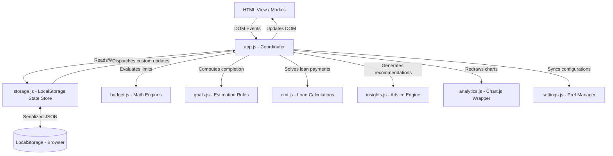

# System Design - Smart Finance Pro

This document outlines the architecture, data structures, and module responsibilities of **Smart Finance Pro**.

---

## 1. Architecture Overview

Smart Finance Pro uses a modular **Model-View-Controller (MVC)**-like structure built with Vanilla JavaScript (ES6 Modules). The architecture prioritizes client-side independence, data security, and instant UI updates.



### Core Architecture Design Decisions:
1. **Unidirectional UI Update Trigger**: Modifying any data triggers a state rewrite in `storage.js`, which then signals the UI controller (`app.js`) to repaint all tabs using the new state. This eliminates stale data discrepancies.
2. **Pure Utility Modules**: Math engines like `emi.js`, `goals.js`, and `budget.js` are pure functions. They do not maintain internal state or query the DOM, making them highly testable.
3. **Chart Isolation**: Standardizing Chart.js controls in `analytics.js` prevents memory leaks by systematically destroying previous canvas instances before instantiating new objects.

---

## 2. Data Flow

### Transaction Addition & Budget Check Flow:
1. User enters data into the **Transaction Modal** and submits.
2. `app.js` captures the submission event, validates the input values (e.g., amount > 0, valid date format), and calls `addTransaction(tx)` in `storage.js`.
3. `storage.js` updates the in-memory array, sorts it, and writes the entire updated state back to `LocalStorage`.
4. `app.js` runs a budget alarm query by invoking `checkBudgetAlerts(category, month)` in `budget.js`.
5. If the current month's spending exceeds 80% or 100% of the category limit, `budget.js` returns an alert configuration.
6. `app.js` presents the corresponding toast notification (`warning` or `danger`).
7. `app.js` re-renders all active HTML segments, recalculates available balances, and redraws Chart.js canvases.

---

## 3. LocalStorage Structure

The application saves all user configurations under a single LocalStorage key: `smart_finance_pro_state`. This prevents namespace pollution in the browser context.

### JSON Schema Structure:

```json
{
  "transactions": [
    {
      "id": "tx-1686259000000",
      "type": "expense",
      "category": "Food",
      "amount": 2500,
      "date": "2026-06-05",
      "description": "Weekly Groceries"
    }
  ],
  "budgets": {
    "Food": 15000,
    "Bills": 25000
  },
  "goals": [
    {
      "id": "goal-1686259100000",
      "name": "Emergency Fund",
      "target": 150000,
      "current": 85000,
      "deadline": "2026-12-31"
    }
  ],
  "recurring": [
    {
      "id": "rec-1686259200000",
      "name": "Gym Membership",
      "amount": 2000,
      "category": "Entertainment",
      "frequency": "monthly",
      "dayOfMonth": 10,
      "lastBilledDate": "2026-05-10"
    }
  ],
  "achievements": [
    {
      "id": "ach-1",
      "name": "Saved ₹10,000",
      "description": "Accumulate more than ₹10,000 in savings",
      "unlocked": true,
      "unlockedDate": "2026-05-15"
    }
  ],
  "settings": {
    "theme": "dark",
    "currency": "INR"
  }
}
```

---

## 4. Module Responsibilities

| Module | Core Responsibility |
| :--- | :--- |
| **`storage.js`** | Handles serialization and deserialization of the global state. Exposes CRUD APIs for transactions, budgets, goals, recurring schedules, and achievements. Manages backup JSON exporting and schema-checked importing. |
| **`budget.js`** | Calculates aggregate expenditures by category for any given month. Evaluates spending limits and flags 80% and 100% threshold violations. |
| **`goals.js`** | Tracks goal progress ratios. Computes historical monthly net savings averages and models date estimations (On Track / Behind) for savings deadlines. |
| **`emi.js`** | Processes interest calculations based on loan parameters. Generates monthly amortization payment structures. |
| **`insights.js`** | Runs trend heuristic calculations (Highest spending categories, Month-over-Month expenditure drift, savings rate fluctuations) to output contextual recommendations. |
| **`analytics.js`** | Aggregates logs to draw charts (Pie, Bar, Comparison, and Line graphs). Manages layout adjustments and canvas redraw operations when theme toggles. |
| **`settings.js`** | Configures and binds theme classes (`dark-theme`/`light-theme`), currency symbols, reset routines, and JSON backup file uploads. |
| **`app.js`** | Acts as the main app controller. Instantiates routing links, event listeners, CRUD form bindings, achievements unlocks, automated recurring bill posting, and HTML statement compiles for PDF export. |
| **`sampleData.js`** | Exports mock datasets spanning a 3-month window relative to the current local date, ensuring the app is immediately populated on first launch. |
